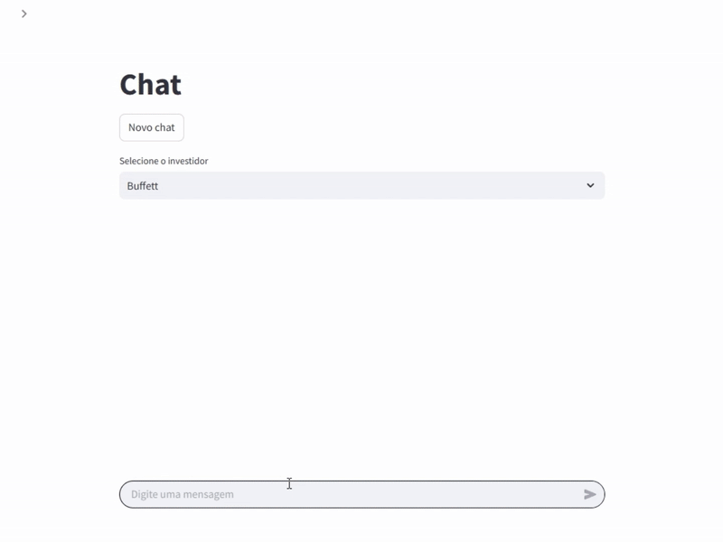
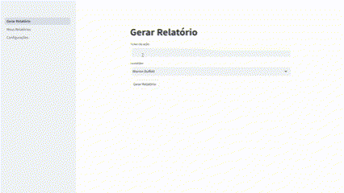

# Investidor-IA 

**Investidor-IA** é um projeto open-source em Python que utiliza modelos de linguagem (LLMs) para gerar relatórios de análise de ações no mercado brasileiro, simulando o estilo de investidores renomados como Warren Buffett, Benjamin Graham, Peter Lynch, Luiz Barsi, entre outros. O sistema coleta dados públicos de diversas fontes, processa-os através de agentes especializados e gera relatórios detalhados no estilo do investidor escolhido.

PS: Atualmente o projeto funciona apenas com o Gemini. OpenAI e outros LLMs serão implementados no futuro.

Você pode gerar um api key do Gemini de forma gratuita no site da google:
https://aistudio.google.com/apikey


## Chat

Selecione algum investidor para conversar. O investidor tem acesso à internet e consegue pesquisar dados recentes da ação.




## Relatórios

O processo segue o seguinte fluxo:

1. O usuário fornece o código de uma ação brasileira (exemplo: `PETR4`, `VALE3`, `ITUB4`)
2. O usuário seleciona um investidor renomado (Warren Buffett, Benjamin Graham, Peter Lynch ou Luiz Barsi)
3. O sistema coleta automaticamente dados e notícias relevantes sobre a ação
4. Analistas especializados processam diferentes aspectos: resultados financeiros, valuation, notícias e releases
5. O investidor selecionado analisa todos os dados e relatórios dos analistas
6. Um relatório detalhado é gerado com análises aprofundadas e recomendações no estilo do investidor escolhido



## Instalação

### Se você não tem Git e Python, o jeito mais simples é usando o [uv](https://github.com/astral-sh/uv)
1. Instale o uv   
    Para isso, abra o terminal e execute o comando ou visite o link https://docs.astral.sh/uv/getting-started/installation:
    ```bash
    # Para windows
    powershell -ExecutionPolicy ByPass -c "irm https://astral.sh/uv/install.ps1 | iex"

    # Para Linux/Mac
    curl -LsSf https://astral.sh/uv/install.sh | sh
    ```

2. Faça o download do zip do código aqui: https://codeload.github.com/renanmoretto/investidor-ia/zip/refs/heads/main

3. Extraia o código para uma pasta
4. Abra um novo terminal e vá para o caminho da pasta extraída, exemplo:
    ```bash
    cd "C:\Downloads\investidor-ia-main"
    ```
5. Execute o código
    ```bash
    uv run app.py
    ```
    O aplicativo deve abrir automaticamente  no navegador, se não abrir, entre no link: http://localhost:8501/


6. Vá na página de Configurações, insira sua api key, clique em salvar, dê um refresh na página e pronto, só usar.

### Se você tem Git e Python

#### Clone o repositório:
```bash
git clone https://github.com/renanmoretto/investidor-ia.git
cd investidor-ia
```

#### Se estiver com uv instalado, só executar
```bash
uv run app.py
```

#### Se não tiver o uv
Crie e ative um ambiente virtual (caso não esteja usando o uv):
```bash
python -m venv .venv

# No Windows
.venv\Scripts\activate

# No Linux/Mac
source .venv/bin/activate
```

Instale as dependências:
```bash
pip install -e .
```

Execute o app:

```bash
python app.py
```


Vá na página de Configurações, insira sua api key do Gemini, clique em salvar e dê um refresh na página.


## Disclaimer

**IMPORTANTE**: Este projeto é EXCLUSIVAMENTE para fins educacionais e de aprendizado. Não tem qualquer intenção de se tornar um produto comercial e, sob nenhuma circunstância, deve ser considerado como uma análise financeira real ou profissional.

As análises geradas por este sistema:
- NÃO constituem recomendações de investimento
- NÃO devem ser utilizadas para tomar decisões financeiras
- NÃO substituem o aconselhamento de profissionais qualificados
- NÃO garantem precisão, completude ou adequação para qualquer propósito específico

O projeto foi desenvolvido como um exercício de programação e aplicação de inteligência artificial, sem qualquer validação por profissionais do mercado financeiro. Os desenvolvedores não se responsabilizam por quaisquer perdas ou danos resultantes do uso destas informações.

Investimentos em renda variável envolvem riscos significativos e podem resultar em perdas patrimoniais. Sempre consulte um profissional financeiro certificado antes de tomar decisões de investimento.

## Contribuindo

Contribuições são bem-vindas! Sinta-se à vontade para abrir issues ou enviar pull requests.

## Licença

Este projeto está licenciado sob a licença MIT - veja o arquivo LICENSE para mais detalhes.


## TODOs
* Mais investidores (Peter Lynch, Munger, Ackman, etc)
* Analista técnico (price action e gráficos)
* Analista macro
* Export do relatório para PDF
* Colocar o wikipedia da empresa como conteúdo (talvez melhore a qualidade de alguns AIs)